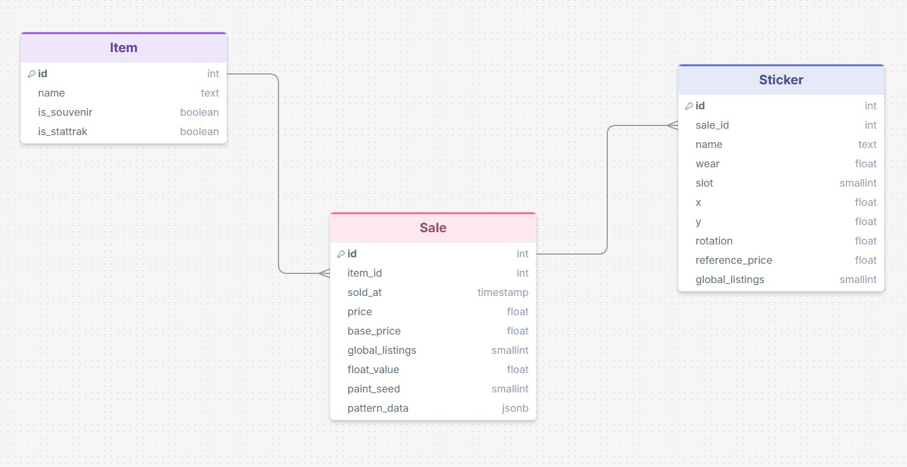

# Русский (RU)

## О проекте 🧩

`CSFloat_sales_parser` — это инструмент автоматического сбора и структурирования данных о последних продажах с торговой платформы CSFloat.

Проект предназначен для извлечения исторических данных о сделках с внутриигровыми предметами Counter-Strike 2 и их последующего хранения в структурированной базе данных PostgreSQL.

Система позволяет:

- собирать данные о последних продажах предметов (раздел "Latest Sales");
- извлекать детальную информацию о каждой транзакции (цена, дата и время продажи, степень износа, шаблон раскраски, нанесённые наклейки);
- структурировать и нормализовать данные для дальнейшего анализа.


## Требования ✅

### Что понадобится для работы 🧰

- **Аккаунт на CSFloat** (`csfloat.com`)
  - при **первом запуске** потребуется вручную авторизоваться в открывшемся окне браузера
- **Docker + Docker Compose**
  - используется для запуска PostgreSQL (смотреть `docker-compose.yml`)
- **Python 3.13+**
  - версия зафиксирована в `.python-version`
- **uv**
  - пакетный менеджер используется для установки зависимостей и запуска (`uv sync`, `uv run ...`)
- **Google Chrome**
  - Selenium будет управлять браузером

### Авторизация при первом запуске 🔐

Парсер использует постоянный профиль Chrome в папке `chrome_profile/`.

При первом запуске откроется окно Chrome. Войдите в аккаунт CSFloat через Steam, затем закройте окно вручную. После успешной авторизации профиль сохранится в `chrome_profile/` (в корне проекта появится директория с таким названием) и следующие запуски будут использовать эту сессию.

Если нужно "сбросить" авторизацию — удалите папку `chrome_profile/`.

## База данных 🗄️

Парсер сохраняет результаты в PostgreSQL, запущенный в Docker-контейнере. Ниже описаны таблицы, которые создаются из моделей в `src/parser/models.py`.

### Таблица `item` 🧷

Содержит уникальные **Хэш-имена** предметов без привязки к конкретной продаже.

| Поле | Тип (PostgreSQL) | Описание |
|---|---|---|
| `id` | `integer` | Идентификатор предмета (первичный ключ) |
| `name` | `text` | Хэш-имя предмета в Steam |
| `is_souvenir` | `boolean` | Признак Souvenir (является ли предмет сувенирным) |
| `is_stattrak` | `boolean` | Признак StatTrak (обладает ли предмет технологией StatTrak) |
| `last_parsed_at` | `timestamp` | Дата и время последнего парсинга предмета |

⚠️ Обратите внимание на то, что следующие предметы имеют разные хэш-имена:
- AWP | Dragon Lore (Factory New);
- AWP | Dragon Lore (Well-Worn);
- Souvenir AWP | Dragon Lore (Field-Tested).

### Таблица `sale` 💸

Записи о продажах конкретного предмета.

| Поле | Тип (PostgreSQL) | Описание |
|---|---|---|
| `id` | `integer` | Идентификатор продажи (первичный ключ) |
| `item_id` | `integer` | FK → `item.id`, каскадное удаление |
| `sold_at` | `timestamp` | Дата/время продажи |
| `price` | `numeric(10,2)` | Цена продажи |
| `base_price` | `numeric(10,2)` | Рыночная стоимость предмета на момент продажи |
| `global_listings` | `integer` | Количество глобальных листингов на момент продажи |
| `float_value` | `double precision` | Степень износа предмета |
| `paint_seed` | `smallint` | Шаблон раскраски |
| `pattern_data` | `jsonb` | Дополнительная информация о паттерне (актуально для скинов "Градиент", "Поверхностная закалка" и так далее) |

### Таблица `sticker` 🏷️

Стикеры, привязанные к конкретному проданному предмету.

| Поле | Тип (PostgreSQL) | Описание |
|---|---|---|
| `id` | `integer` | Идентификатор стикера (первичный ключ) |
| `sale_id` | `integer` | FK → `sale.id`, каскадное удаление |
| `name` | `text` | Название стикера |
| `wear` | `double precision` | Износ стикера (в процентах) |
| `slot` | `smallint` | Слот |
| `x` | `double precision` | Координата X, если выбрана не позиция по умолчанию |
| `y` | `double precision` | Координата Y, если выбрана не позиция по умолчанию |
| `rotation` | `double precision` | Поворот, если выбрана не позиция по умолчанию |
| `reference_price` | `numeric(10,2)` | Стоимость стикера на момент продажи |
| `global_listings` | `smallint` | Число листингов стикера на момент продажи |

### Схема базы данных

ER-диаграмма базы данных представлена на Рисунке 1.
<p align="center">
  
  <br>
  <strong>Рисунок 1 - ER-диаграмма базы данных</strong>
</p>

## Подробная инструкция запуска (Windows / PowerShell) 🚀

Ниже — пошаговый сценарий от клонирования репозитория до запуска парсера.

### 1) Клонировать репозиторий и перейти в папку проекта

```powershell
git clone https://github.com/kof3stt/csfloat-sales-parser.git
cd csfloat-sales-parser
```

### 2) Установить зависимости (используйте пакетный менеджер uv)

Установка/синхронизация окружения:

```powershell
uv sync
```

### 3) Запустить PostgreSQL в Docker (через Compose)

В проекте есть `docker-compose.yml` с сервисом `db`. Запуск:

```powershell
docker compose up -d db
```

Проверить, что контейнер запущен:

```powershell
docker compose ps
```

По умолчанию PostgreSQL проброшен наружу на порт **5433** (смотреть `docker-compose.yml`: `5433:5432`).

### 4) Настроить `config.toml`

Откройте `config.toml` в корне проекта и настройте:

- `currency`;
- `[logging]`;
- список предметов `[[items]]`.

Детально о параметрах — в разделе "Настройка".

### 5) Подготовить `.env`

Создайте в корне проекта файл `.env`. Детально о параметрах — в разделе "Настройка".

### 6) Запустить парсер

Запуск из корня проекта:

```powershell
uv run python -m src.parser.main
```

Что ожидать:
- откроется окно Chrome;
- при первом запуске выполните **ручную авторизацию** на `csfloat.com`;
- далее парсер начнёт обработку предметов из `config.toml` и запись данных в PostgreSQL.

### 7) Где смотреть логи и что создаётся на диске

- **логи**: по умолчанию в папке `logs/` (настраивается через `config.toml` → `[logging].dir`).
  Файл создаётся с временной меткой вида `CSFloat_sales_parser_YYYY-MM-DD_HH-MM-SS.log`.
- **профиль Chrome**: папка `chrome_profile/` в корне проекта.

Если что-то пошло не так — первым делом откройте последний лог-файл.

### 8) Как остановить

Нажмите `Ctrl + C` в терминале, где запущен парсер и закройте окно браузера.

## Настройка ⚙️

### `config.toml` 📝

Файл `config.toml` читается **из корня проекта**.

#### `currency` 💱

Строка, валюта интерфейса CSFloat.

Пример:

```toml
currency = "USD"
```

Поддерживаемые значения (из `src/parser/enums.py`):
`USD`, `EUR`, `GBP`, `CAD`, `AED`, `AUD`, `BRL`, `CHF`, `CNY`, `CZK`, `DKK`, `GEL`, `HKD`, `HUF`, `IDR`, `ILS`, `KHR`, `KZT`, `MYR`, `MXN`, `NOK`, `NZD`, `PLN`, `RON`, `RSD`, `SAR`, `SEK`, `SGD`, `THB`, `TRY`, `TWD`, `UAH`.

Если указать значение вне списка — приложение упадёт при старте (enum validation).

#### `[logging]` 📜

Настройки логирования.

Пример:

```toml
[logging]
dir = "logs"
level = "DEBUG"
```

- `dir`: папка для логов (будет создана автоматически)
- `level`: уровень логирования
  - `DEBUG` — максимально подробно;
  - `INFO` — стандартно;
  - `WARNING` — только проблемы;
  - `ERROR` — только ошибки;
  - `CRITICAL` — только критические (в данный момент не поддерживается, все ошибки имеют уровень ERROR).

#### `[[items]]` 🎯

Список предметов для обработки. Каждый предмет — отдельный блок.

Минимальный пример (1 предмет):

```toml
[[items]]
name = "AK-47 | Case Hardened (Field-Tested)"
```

Несколько предметов:

```toml
[[items]]
name = "★ StatTrak™ Gut Knife | Marble Fade (Minimal Wear)"

[[items]]
name = "M249 | Downtown (Field-Tested)"
```

Важно:

- `name` должен совпадать с **хэш-именем** предмета в Steam (включая `StatTrak™`/`Souvenir` и качеством предмета в скобках, если нужно);
- парсер сам нормализует имя для поиска, но фильтры (wear / StatTrak / Souvenir) применяются исходя из `name`.
### `.env` (настройка окружения) 🔐

Файл `.env` используется для хранения параметров подключения к базе данных PostgreSQL и настроек резервного копирования. Он создаётся вручную в корне проекта и не должен попадать в систему контроля версий (Git).

#### 📄 Пример .env
```
DB_HOST=localhost
DB_PORT=5433
DB_USER=postgres
DB_PASSWORD=postgres
DB_NAME=csfloat

DB_ECHO=false

DB_BACKUP_ENABLED=false
BACKUP_DIR=backups
BACKUP_FILE=csfloat_backup.sql
```

#### ⚙️ Описание параметров
- DB_HOST — адрес PostgreSQL сервера;
- DB_PORT — порт PostgreSQL;
- DB_USER — пользователь базы данных;
- DB_PASSWORD — пароль пользователя;
- DB_NAME — имя базы данных;
- DB_ECHO - включает логирование всех SQL-запросов:
  - true — вывод SQL запросов в консоль
  - false - отключено
- DB_BACKUP_ENABLED - управляет созданием бэкапа после завершения парсинга:
  - true — бэкап создаётся автоматически
  - false - отключено
- BACKUP_DIR - папка для хранения бэкапов (создаётся автоматически);
- BACKUP_FILE - имя файла бэкапа.

⚠️ При каждом запуске файл с бэкапом перезаписывается (старый удаляется).

## Артефакты и Git 🧹

Проект создаёт локальные файлы/папки, которые **не должны попадать в репозиторий**:

- `chrome_profile/` — профиль Chrome для Selenium (сессии/куки)
- `logs/` и `*.log` — логи

Это уже учтено в `.gitignore`.


# English (EN)

## About 🧩

`CSFloat_sales_parser` is a tool for automated collection and normalization of **latest sales** data from the CSFloat marketplace.

The project is designed to extract historical trade data for Counter-Strike 2 in-game items and persist it in a structured PostgreSQL database.

The tool can:

- collect latest sales rows for items (the “Latest Sales” section);
- extract detailed transaction metadata (price, sold date/time, wear/float, paint seed/pattern, applied stickers);
- normalize the data for further analysis.

## Requirements ✅

### Prerequisites 🧰

- **CSFloat account** (`csfloat.com`)
  - on the **first run** you must authenticate manually in the browser window
- **Docker + Docker Compose**
  - used to run PostgreSQL (see `docker-compose.yml`)
- **Python 3.13+**
  - pinned in `.python-version`
- **uv**
  - used to install dependencies and run the project (`uv sync`, `uv run ...`)
- **Google Chrome**
  - Selenium controls the browser

### First-run authentication 🔐

The parser uses a persistent Chrome profile stored in `chrome_profile/`.

On the first run, Chrome will open. Log in to CSFloat via Steam, then close the window manually. After successful authentication, the profile will be stored in `chrome_profile/` (a directory with this name will appear in the project root) and subsequent runs will reuse the same session.

To reset authentication, delete the `chrome_profile/` directory.

## Database 🗄️

The parser stores results in PostgreSQL running in a Docker container. Below are the tables created from the models in `src/parser/models.py`.

### Table `item` 🧷

Stores unique item **hash names** without linking to a specific sale.

| Column | Type (PostgreSQL) | Description |
|---|---|---|
| `id` | `integer` | Item identifier (primary key) |
| `name` | `text` | Steam item hash name |
| `is_souvenir` | `boolean` | Souvenir flag |
| `is_stattrak` | `boolean` | StatTrak flag |
| `last_parsed_at` | `timestamp` | Last time the item was parsed by the scraper |

⚠️ Note that the following items have different hash names:

- `AWP | Dragon Lore (Factory New)`;
- `AWP | Dragon Lore (Well-Worn)`;
- `Souvenir AWP | Dragon Lore (Field-Tested)`.

### Table `sale` 💸

Sales records for a specific item.

| Column | Type (PostgreSQL) | Description |
|---|---|---|
| `id` | `integer` | Sale identifier (primary key) |
| `item_id` | `integer` | FK → `item.id`, cascade delete |
| `sold_at` | `timestamp` | Sold date/time |
| `price` | `numeric(10,2)` | Sale price |
| `base_price` | `numeric(10,2)` | Base market price at the time of sale |
| `global_listings` | `integer` | Global listings count at the time of sale |
| `float_value` | `double precision` | Item wear (float value) |
| `paint_seed` | `smallint` | Paint seed (pattern seed) |
| `pattern_data` | `jsonb` | Additional pattern metadata (e.g., Fade / Case Hardened, etc.) |

### Table `sticker` 🏷️

Stickers linked to a specific sold item (sale).

| Column | Type (PostgreSQL) | Description |
|---|---|---|
| `id` | `integer` | Sticker identifier (primary key) |
| `sale_id` | `integer` | FK → `sale.id`, cascade delete |
| `name` | `text` | Sticker name |
| `wear` | `double precision` | Sticker wear (percent) |
| `slot` | `smallint` | Slot |
| `x` | `double precision` | X coordinate (if not default placement) |
| `y` | `double precision` | Y coordinate (if not default placement) |
| `rotation` | `double precision` | Rotation (if not default placement) |
| `reference_price` | `numeric(10,2)` | Sticker reference price at sale time |
| `global_listings` | `smallint` | Sticker listings count at sale time |

### Database schema

The ER diagram is provided in Figure 1.

<p align="center">
  
  <br>
  <strong>Figure 1 - Database ER diagram</strong>
</p>

## Detailed run guide (Windows / PowerShell) 🚀

Below is a step-by-step workflow from cloning the repository to running the parser.

### 1) Clone the repository and enter the project directory

```powershell
git clone https://github.com/kof3stt/csfloat-sales-parser.git
cd csfloat-sales-parser
```

### 2) Install dependencies (use uv)

Environment sync / dependency install:

```powershell
uv sync
```

### 3) Start PostgreSQL in Docker (Compose)

The project includes `docker-compose.yml` with a `db` service. Start it with:

```powershell
docker compose up -d db
```

Check that the container is running:

```powershell
docker compose ps
```

By default, PostgreSQL is exposed on **5433** (see `docker-compose.yml`: `5433:5432`).

### 4) Configure `config.toml`

Open `config.toml` in the project root and configure:

- `currency`;
- `[logging]`;
- the `[[items]]` list.

See the "Configuration" section for details.

### 5) Prepare `.env`

Create a `.env` file in the project root. See the "Configuration" section for details.

### 6) Run the parser

Run from the project root:

```powershell
uv run python -m src.parser.main
```

Expected behavior:

- a Chrome window will open;
- on the first run, complete the **manual authentication** at `csfloat.com`;
- after that, the parser will process items from `config.toml` and write data to PostgreSQL.

### 7) Logs and generated files

- **logs**: by default in `logs/` (configured via `config.toml` → `[logging].dir`).
  A log file is created with a timestamp like `CSFloat_sales_parser_YYYY-MM-DD_HH-MM-SS.log`.
- **Chrome profile**: `chrome_profile/` in the project root.

If something goes wrong, open the latest log file first.

### 8) How to stop

Press `Ctrl + C` in the terminal where the parser is running and close the browser window.

## Configuration ⚙️

### `config.toml` 📝

The `config.toml` file is loaded **from the project root**.

#### `currency` 💱

String value: CSFloat UI currency.

Example:

```toml
currency = "USD"
```

Supported values (from `src/parser/enums.py`):
`USD`, `EUR`, `GBP`, `CAD`, `AED`, `AUD`, `BRL`, `CHF`, `CNY`, `CZK`, `DKK`, `GEL`, `HKD`, `HUF`, `IDR`, `ILS`, `KHR`, `KZT`, `MYR`, `MXN`, `NOK`, `NZD`, `PLN`, `RON`, `RSD`, `SAR`, `SEK`, `SGD`, `THB`, `TRY`, `TWD`, `UAH`.

If a value outside this list is provided, the application will fail on startup (enum validation).

#### `[logging]` 📜

Logging configuration.

Example:

```toml
[logging]
dir = "logs"
level = "DEBUG"
```

- `dir`: log directory (created automatically)
- `level`: log level
  - `DEBUG` — maximum verbosity;
  - `INFO` — default;
  - `WARNING` — warnings only;
  - `ERROR` — errors only;
  - `CRITICAL` — critical only (not supported at the moment; errors are logged at ERROR level).

#### `[[items]]` 🎯

List of items to process. Each item is a separate block.

Minimal example (1 item):

```toml
[[items]]
name = "AK-47 | Case Hardened (Field-Tested)"
```

Multiple items:

```toml
[[items]]
name = "★ StatTrak™ Gut Knife | Marble Fade (Minimal Wear)"

[[items]]
name = "M249 | Downtown (Field-Tested)"
```

Important:

- `name` must match the item **hash name** (including `StatTrak™` / `Souvenir` and wear in parentheses when applicable);
- the parser normalizes the name for search, but filters (wear / StatTrak / Souvenir) are derived from `name`.

### `.env` (environment configuration) 🔐

The `.env` file is used to store PostgreSQL connection parameters and backup settings. It must be created manually in the project root and must not be committed to Git.

#### 📄 Example `.env`

```
DB_HOST=localhost
DB_PORT=5433
DB_USER=postgres
DB_PASSWORD=postgres
DB_NAME=csfloat

DB_ECHO=false

DB_BACKUP_ENABLED=false
BACKUP_DIR=backups
BACKUP_FILE=csfloat_backup.sql
```

#### ⚙️ Parameter reference

- `DB_HOST` — PostgreSQL server address;
- `DB_PORT` — PostgreSQL port;
- `DB_USER` — database user;
- `DB_PASSWORD` — database user password;
- `DB_NAME` — database name;
- `DB_ECHO` — enables SQL query logging:
  - `true` — print SQL queries to console
  - `false` — disabled
- `DB_BACKUP_ENABLED` — controls automatic backup after parsing:
  - `true` — backup is created automatically
  - `false` — disabled
- `BACKUP_DIR` — directory for backups (created automatically);
- `BACKUP_FILE` — backup file name.

⚠️ On each run, the backup file is overwritten (the previous file is replaced).

## Artifacts and Git 🧹

The project creates local files/directories that **must not be committed**:

- `chrome_profile/` — Selenium Chrome profile (sessions/cookies)
- `logs/` and `*.log` — logs

This is already covered by `.gitignore`.

